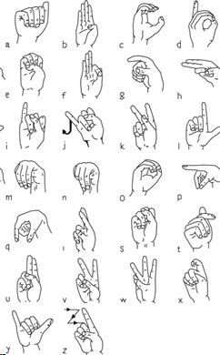
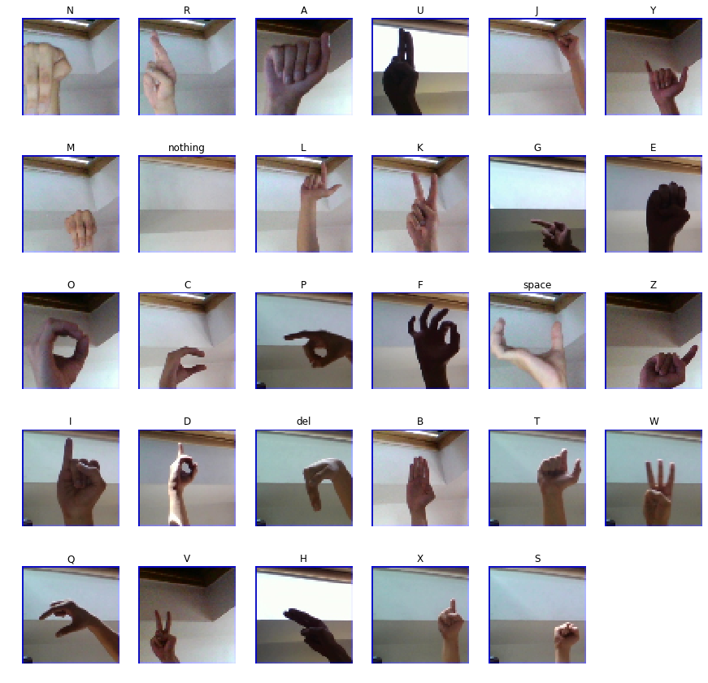

# ASL Static Hand Gesture Recognition - Deep Learning

## Motivation
In present world, There are many people who are facing **difficulty expressing feelings and to talk to others due to deafness**.
I have made a application which can help them achieve one step towards connecting to others. This application converts **American Sign Language characters to English Alpabets**.

## Demo Application

  
  

              
       

## ASL Test Dataset

### Dataset Description

  

    <h4>Sourced from <a href="https://www.kaggle.com/grassknoted/asl-alphabet">grassknoted</a>.</h4>
  

  
  <ul>
    <li>The training data set contains 87,000 images which are 200x200 pixels.</li>
    <li>There are 29 classes, of which 26 are for the letters A-Z and 3 classes for SPACE, DELETE and NOTHING.</li>
    <li>These 3 classes are very helpful in real time applications, and classification.</li>
    <li>The test data set contains a mere 29 images, to encourage the use of real world test images.</li>
    <li>This dataset contains some augmented data.</li>
  </ul>

       

## TensorFlow Model Output

  
  

              

## Skills Learnt

- Convolutional Neural Network Basics
- Explored small segment of OpenCV
- Improved data manipulation and visualization

